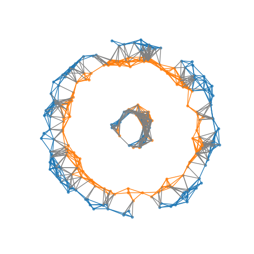

# Geometric Component Analysis (GeomCA)
Official Python implementation of the algorithm presented in the paper  "[GeomCA: Geometric Evaluation of Data Representations]()". If you use this code in your work, please cite it as follows:

## Bibtex

```
@article{poklukar2021geomca,
  title={GeomCA: Geometric Evaluation of Data Representations},
  author={Poklukar, Petra and Varava, Anastasia and Kragic, Danica},
  journal={arXiv preprint arXiv:2105.12486},
  year={2021}
}
```

## Getting started
### Setup

```
pip install -r requirements.txt
```

### Basic usage

1. Create np arrays containing points `R` and `E`.
2. Adjust GeomCA template config `config/template_config.py` with desired method parameters and save it in `config` folder (see the same folder for more examples).
3. Add the code snippet below to your application

```
from GeomCA import GeomCA
from importlib.machinery import SourceFileLoader

# Loads the config
config_file = os.path.join('configs', args_opt.config_name)
config = SourceFileLoader(args_opt.config_name, config_file).load_module().config 

# Runs GeomCA
GeomCA_graph = GeomCA(R, E, config['GeomCA'])
GeomCA_results = GeomCA_graph.get_connected_components()

# Visualizes the results
GeomCA_graph.plot_connected_components()
GeomCA_graph.plot_RE_components_quality(min_comp_size=5)    
GeomCA_graph.plot_RE_components_quality(min_comp_size=2)    
```

4. The results will be saved to the `experiment_path` set in the config file in the following structure:


```
experiment_path
  /GeomCA_logs
    - components_stats.pkl      # Dictionary containing local statistics for each component
    - network_parameters.pkl    # Dictionary containing network parameters
    - network_stats.pkl         # Disctionary containing global statistics for the entire graph
    - reduced_points.pkl        # Dictionary containing reduced points (if saved)
  /GeomCA_results
    - network_stats.txt         # Above scores in a readable .txt format
    - visualization of local statistics
  /point_clouds
    - visuzalization of projected point clouds
  .log                          # Logs file
```


### First example

Run GeomCA on 2-dimensional points R and E placed in circles of various formats:

```
python examples_2Dcircle_data.py
```

Below is an example of GeomCA scores obtained on the following arrangements of R (blue) and E (orange) points:




```
--- GeomCA parameters
num_R_points: 120                         # Total number of R points used
num_E_points: 120                         # Total number of E points used
num_RE_points: 240                        # Sum of R and E points
epsilon: 0.3054616185274289               # Epsilon value used to build the graph (Definition 2.1)
gamma: 1                                  # Spasification value: delta = gamma * epsilon (Definition 3.1)
comp_consistency_threshold: 0.0           # Consistency threshold eta_c (Definition 2.5)
comp_quality_threshold: 0.3               # Quality threshold eta_q (Definition 2.5)

--- GeomCA network stats
num_R_points_in_qualitycomp: 20           # Total number of R points in components with scores larger than eta_c, eta_q
num_E_points_in_qualitycomp: 20           # Total number of E points in components with scores larger than eta_c, eta_q
precision: 0.16666666666666666            # Global score: precision (Definition 2.5)
recall: 0.16666666666666666               # Global score: recall (Definition 2.5)
network_consistency: 1.0                  # Global score: network consistency (Definition 2.4)
network_quality: 0.32293423271500843      # Global score: network quality (Definition 2.4)

--- GeomCA comp stats                     # Local scores
c(G0): 1.00, q(G0): 0.27, |G0^R|_v: 100 , |G0^E|_v: 100 , |G0|_v: 200  # Component 0: statistics (Definitions 2.2 and 2.3) and sizes
c(G1): 1.00, q(G1): 0.50, |G1^R|_v: 20  , |G1^E|_v: 20  , |G1|_v: 40   # Component 1: statistics (Definitions 2.2 and 2.3) and sizes
```

which should appear in the file "problematic_overlap_network_stats.txt" in folder "examples/toy_2Dcircle_data/problematic_overlap/GeomCA_results" along with other visualizatons supported by the algorithm.

## Reproducing experiments from the paper
### Datasets

Download the representations used in the experiments:[GeomCA datasets](https://drive.google.com/drive/folders/1Vi14jZyRddK-LQW6CoFnyhYoo-vBowjM?usp=sharing) and place in "datasets/" folder. We provide all the representations used in multiview box experiment (Section 4) and VGG16 experiment (Section 6). For stylegan, we provide a smaller dataset containing 5000 representations in each of the sets, used in robustness and complexity analysis experiments (Appendix 8.2). 

### Experiments

Reproduce multiview box experiments from Section 4:

```
python multiview_box_mode_truncation_experiment.py --config_name=multiview_box_mode_truncation_siamese_Df.py --train --run_GeomCA=1 
python multiview_box_mode_truncation_experiment.py --config_name=multiview_box_mode_truncation_siamese_Dm.py --train --run_GeomCA=1 

python multiview_box_epsilon_experiment.py --config_name=multiview_box_epsilon_siamese_Df.py --run_GeomCA=1
python multiview_box_epsilon_experiment.py --config_name=multiview_box_epsilon_simCLR_Df.py --run_GeomCA=1
```

Reproduce stylegan experiments from Section 5 (using the provided datasets):

```
python stylegan_truncation_experiment.py --config_name=stylegan_truncation_5k_perc10_gamma1.py --train --run_GeomCA=1 
```

Reproduce VGG16 experiments from Section 6:

```
python vgg16_experiment.py --config_name=vgg16_version1.py --train --run_GeomCA=1 
python vgg16_experiment.py --config_name=vgg16_version2.py --train --run_GeomCA=1 
```

If you wish to benchmark the results with [Geometry Score](https://github.com/KhrulkovV/geometry-score) and [Improved Precision and Recall](https://github.com/kynkaat/improved-precision-and-recall-metric) scores add the flags `--run_IPR=1 --run_GS=1` to the above commands. The provided requirements.txt should already install all the necessary packages. Note that IPR implementation is based on GPU calculations.


